# Firesearch - AI-Powered Deep Research Tool

<div align="center">
  
</div>

**Version 1.1** - Comprehensive web research powered by [Firecrawl](https://www.firecrawl.dev/) and [LangGraph](https://www.langchain.com/langgraph)

## 🚀 What's New in v1.1

- **💻 Advanced Settings Page** - Comprehensive configuration with environment detection
- **🔧 Multiple LLM Provider Support** - OpenAI, Anthropic, OpenRouter, Google Gemini, Groq, Grok AI, and Deepseek
- **🎨 Enhanced UI/UX** - Reorganized navigation, floating contribute button, improved visuals
- **🗺️ Comprehensive Roadmap** - Chat Page 2.0, advanced features, and planned expansions
- **🔒 Better Security** - Improved API key handling with environment variable precedence
- **📱 Responsive Design** - Optimized for all screen sizes

## 🛠️ Technologies

- **[Firecrawl](https://www.firecrawl.dev/)**: Multi-source web content extraction and search
- **[LangGraph](https://www.langchain.com/langgraph)**: Intelligent agent workflow orchestration
- **Multiple LLM Providers**: OpenAI GPT-4o, Anthropic Claude, Google Gemini, and more
- **[Next.js 15](https://nextjs.org/)**: Modern React framework with App Router and Turbopack
- **TypeScript**: Type-safe development with comprehensive error handling

[](https://vercel.com/new/clone?repository-url=https%3A%2F%2Fgithub.com%2Fmendableai%2Ffiresearch&env=FIRECRAWL_API_KEY,OPENAI_API_KEY&envDescription=API%20keys%20required%20for%20Firesearch&envLink=https%3A%2F%2Fgithub.com%2Fmendableai%2Ffiresearch%23required-api-keys)

## 🔑 API Key Configuration

### Required Keys
| Service | Purpose | Get Key |
|---------|---------|---------|
| **Firecrawl** | Web scraping and content extraction | [firecrawl.dev/app/api-keys](https://www.firecrawl.dev/app/api-keys) |
| **LLM Provider** | AI reasoning and synthesis | See options below |

### Supported LLM Providers

| Provider | Models Available | Get API Key |
|----------|------------------|-------------|
| **OpenAI** | GPT-4o, GPT-4o-mini, GPT-3.5-turbo | [platform.openai.com/api-keys](https://platform.openai.com/api-keys) |
| **Anthropic** | Claude 3.5 Sonnet, Claude 3 Haiku | [console.anthropic.com](https://console.anthropic.com) |
| **Google Gemini** | Gemini Pro, Gemini Flash | [ai.google.dev](https://ai.google.dev) |
| **OpenRouter** | Access to 100+ models | [openrouter.ai/keys](https://openrouter.ai/keys) |
| **Groq** | Ultra-fast Llama, Mixtral, Gemma | [console.groq.com](https://console.groq.com) |
| **Grok AI** | xAI's Grok models | [x.ai](https://x.ai) |
| **Deepseek** | Advanced reasoning models | [platform.deepseek.com](https://platform.deepseek.com) |

## ⚡ Quick Start

### Using pnpm (Recommended)
```bash
# Clone the repository
git clone https://github.com/mendableai/firesearch.git
cd firesearch

# Install dependencies
pnpm install

# Create environment file
cp .env.example .env.local

# Add your API keys to .env.local
FIRECRAWL_API_KEY=your_firecrawl_key
OPENAI_API_KEY=your_openai_key

# Start development server
pnpm dev
```

### Alternative Package Managers
```bash
# Using npm
npm install && npm run dev

# Using yarn
yarn install && yarn dev
```

### Using Docker
```bash
docker build -t firesearch .
docker run -p 3000:3000 --env-file .env.local firesearch
```

## 🎯 Key Features

### Core Capabilities
- **🧠 Smart Query Decomposition** - Breaks complex questions into focused sub-queries
- **🔍 Multi-Source Search** - Searches multiple sources simultaneously via Firecrawl
- **✅ Answer Validation** - Verifies source relevance (0.7+ confidence threshold)
- **🔄 Intelligent Retry Logic** - Alternative search strategies for incomplete answers
- **📄 Real-time Progress** - Live updates as searches complete
- **📚 Full Citations** - Every fact linked to its original source
- **💬 Context Memory** - Follow-up questions maintain conversation history

### User Experience
- **⚙️ Advanced Settings** - Comprehensive configuration with environment detection
- **🎨 Modern UI** - Clean, responsive design with intuitive navigation
- **🔒 Privacy-First** - API keys stored securely in local storage
- **🌐 Cross-Platform** - Works on desktop, tablet, and mobile devices
- **🚀 Fast Performance** - Optimized with Next.js 15 and Turbopack

## 🗺️ Future Roadmap

### Chat Page 2.0
- **💬 Discussion the Research** - Interactive discussions about search results
- **👁️ View Active Model** - Real-time display of models being used
- **📖 Search History** - Browse and revisit previous searches
- **📊 Search Analytics** - Insights into search patterns and cost tracking
- **💰 Real-Time Cost Calculator** - Live cost tracking for each search request
- **✅ Manual Settings Confirmation** - Explicit save actions with confirmation dialogs

### Interface & Theme Enhancements
- **🌙 Dark Mode & Light Mode** - Enhanced theme system with user preferences
- **📱 Responsive Design** - Optimized mobile and tablet experience
- **🎨 Accessibility** - WCAG 2.1 AA compliance and keyboard navigation

### Advanced Features
- **🌍 Multi-Language Support** - Search and interface localization
- **📤 Export & Share** - PDF export and sharing research findings
- **🎤 Voice Search** - Speech-to-text input capabilities
- **🤖 Custom Search Agents** - Specialized research agents for specific domains
- **🔌 Browser Extensions** - Quick access from any webpage
- **📊 Data Visualization** - Charts and graphs for research insights

### LLM Provider Expansions
Support for additional providers including local models, specialized reasoning engines, and emerging AI platforms.

## 🏗️ Architecture

### How It Works

```mermaid
flowchart TB
    Query["User Query:<br/>'Compare latest iPhones'"]:::query
    
    Query --> Break
    
    Break["🔍 Query Decomposition"]:::primary
    
    subgraph SubQ["🌐 Sub-Questions"]
        S1["iPhone 15 Pro specs"]:::search
        S2["iPhone 15 pricing"]:::search
        S3["iPhone 15 vs 14 comparison"]:::search
    end
    
    Break --> SubQ
    
    subgraph FC["🔥 Firecrawl Searches"]
        FC1["Search Apple.com<br/>TechCrunch"]:::firecrawl
        FC2["Search GSMArena<br/>The Verge"]:::firecrawl
        FC3["Search CNET<br/>MacRumors"]:::firecrawl
    end
    
    S1 --> FC1
    S2 --> FC2
    S3 --> FC3
    
    subgraph Valid["✅ Validation"]
        V1["Specs found ✓ (0.95)"]:::good
        V2["Pricing found ✓ (0.85)"]:::good
        V3["Comparison ❌ (0.4)"]:::bad
    end
    
    FC --> Valid
    
    Valid --> Synthesis["🤖 LLM Synthesis"]:::synthesis
    
    Synthesis --> Answer["📄 Cited Response<br/>+ Follow-ups"]:::answer
    
    classDef query fill:#ff8c42,stroke:#ff6b1a,stroke-width:3px,color:#fff
    classDef primary fill:#3a4a5c,stroke:#2c3a47,stroke-width:2px,color:#fff
    classDef search fill:#4caf50,stroke:#388e3c,stroke-width:2px,color:#fff
    classDef firecrawl fill:#ff6b1a,stroke:#ff4500,stroke-width:2px,color:#fff
    classDef good fill:#4caf50,stroke:#388e3c,stroke-width:2px,color:#fff
    classDef bad fill:#f44336,stroke:#d32f2f,stroke-width:2px,color:#fff
    classDef synthesis fill:#9c27b0,stroke:#7b1fa2,stroke-width:2px,color:#fff
    classDef answer fill:#3a4a5c,stroke:#2c3a47,stroke-width:3px,color:#fff
```



### Processing Pipeline

1. **🔍 Query Analysis** - Understanding user intent and complexity
2. **📝 Decomposition** - Breaking into focused sub-questions  
3. **🌐 Multi-Search** - Parallel searches via Firecrawl API
4. **📄 Content Extraction** - Markdown content from relevant sources
5. **✅ Validation** - Confidence scoring for answer completeness
6. **🔄 Retry Logic** - Alternative strategies for gaps
7. **🤖 Synthesis** - LLM combines findings into comprehensive response
8. **📚 Citation** - Full source attribution and follow-up generation

## ⚙️ Configuration

Customize search behavior in the Settings page or via [`lib/config.ts`](lib/config.ts):

```typescript
export const SEARCH_CONFIG = {
  // Search Parameters
  MAX_SEARCH_QUERIES: 12,        // Maximum parallel searches
  MAX_SOURCES_PER_SEARCH: 4,     // Sources per search query
  MAX_SOURCES_TO_SCRAPE: 3,      // Additional content scraping
  
  // Quality Control
  MIN_CONTENT_LENGTH: 100,       // Minimum viable content length
  MIN_ANSWER_CONFIDENCE: 0.7,    // Answer completeness threshold
  
  // Performance
  MAX_RETRIES: 2,                // Retry attempts for failures
  MAX_SEARCH_ATTEMPTS: 2,        // Alternative search strategies
  SCRAPE_TIMEOUT: 15000,         // Content extraction timeout
  
  // Response Generation
  SUMMARY_CHAR_LIMIT: 100,       // Source summary length
  ENABLE_FOLLOW_UPS: true,       // Generate follow-up questions
} as const;
```

## 🧪 Example Queries

### Technology Research
- "Compare the latest iPhone, Samsung Galaxy, and Google Pixel flagship features"
- "What are the key differences between ChatGPT-4 and Claude 3.5 Sonnet?"
- "NVIDIA RTX 4090 vs RTX 4080 Super performance benchmarks"

### Business Intelligence
- "Who are the founders of Firecrawl and what's their background?"
- "Latest funding rounds in AI infrastructure companies 2024"
- "Tesla's Q4 2024 earnings vs analyst expectations"

### Academic Research
- "Recent breakthroughs in quantum computing error correction"
- "Climate change impact on arctic ice coverage 2020-2024"
- "Effectiveness of different learning management systems for remote education"

## 🤝 Contributing

We welcome contributions! Here's how to get started:

1. **Fork the repository**
2. **Create a feature branch**: `git checkout -b feature/amazing-feature`
3. **Make your changes** and ensure tests pass
4. **Commit your changes**: `git commit -m "Add amazing feature"`
5. **Push to your branch**: `git push origin feature/amazing-feature`
6. **Open a Pull Request**

### Development Guidelines
- Follow TypeScript best practices
- Add tests for new features
- Update documentation as needed
- Use conventional commits for messages
- Ensure accessibility compliance

## 📚 API Documentation

### Firecrawl Integration

Firesearch leverages Firecrawl's `/search` endpoint for comprehensive web research:

```typescript
// Search with content extraction
const response = await fetch('/api/search', {
  method: 'POST',
  headers: { 'Content-Type': 'application/json' },
  body: JSON.stringify({
    query: "iPhone 16 specifications",
    limit: 8,
    scrapeOptions: {
      formats: ["markdown"]
    }
  })
});
```

### LLM Provider Integration

Support for multiple providers with unified interface:

```typescript
// Dynamic provider switching
const llmResponse = await queryLLM({
  provider: "openai", // or "anthropic", "gemini", etc.
  model: "gpt-4o",
  messages: [...],
  apiKey: getApiKey(provider)
});
```

## 🔧 Deployment

### Vercel (Recommended)
1. Click the "Deploy with Vercel" button above
2. Add your environment variables in the Vercel dashboard
3. Deploy automatically on every push to main

### Self-Hosting
```bash
# Build for production
pnpm build

# Start production server
pnpm start

# Or use Docker
docker build -t firesearch .
docker run -p 3000:3000 firesearch
```

### Environment Variables
```bash
# Required
FIRECRAWL_API_KEY=your_firecrawl_key
OPENAI_API_KEY=your_openai_key

# Optional (can be set in Settings page)
ANTHROPIC_API_KEY=your_anthropic_key
GOOGLE_API_KEY=your_google_key
OPENROUTER_API_KEY=your_openrouter_key
GROQ_API_KEY=your_groq_key
GROK_API_KEY=your_grok_key
DEEPSEEK_API_KEY=your_deepseek_key
```

## 📄 License

MIT License - see [LICENSE](LICENSE) file for details.

## 🙏 Acknowledgments

- [Firecrawl](https://www.firecrawl.dev/) for powerful web scraping capabilities
- [LangChain](https://www.langchain.com/) for LangGraph agent framework
- [Vercel](https://vercel.com/) for seamless deployment platform
- Open source community for continuous inspiration and contributions

---

<div align="center">
  <strong>Built with ❤️ by the Firesearch Team</strong><br/>
  <em>Powered by Firecrawl and LangGraph</em>
</div>